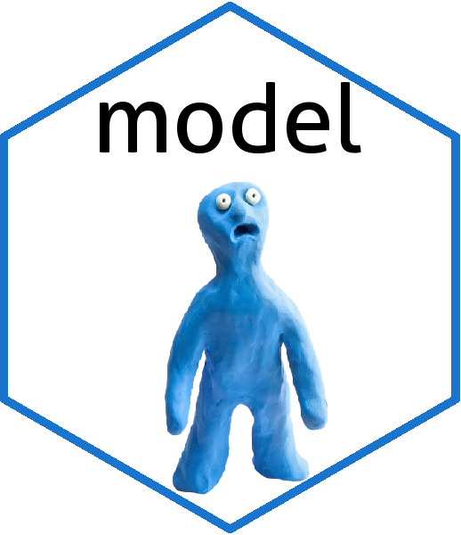

[](https://travis-ci.org/fhernanb/model)
[](https://cran.r-project.org/package=model)
[](https://cran.r-project.org/package=model) 

# model 

An R package with useful functions for modeling regresion.

You can visit the [package website](https://fhernanb.github.io/model/index.html) to explore the vignettes (articles) and function reference. 

### Installation

* Install latest development version from GitHub using the code given below:

```r
if (!require("remotes")) install.packages("remotes")
remotes::install_github("fhernanb/model")
```